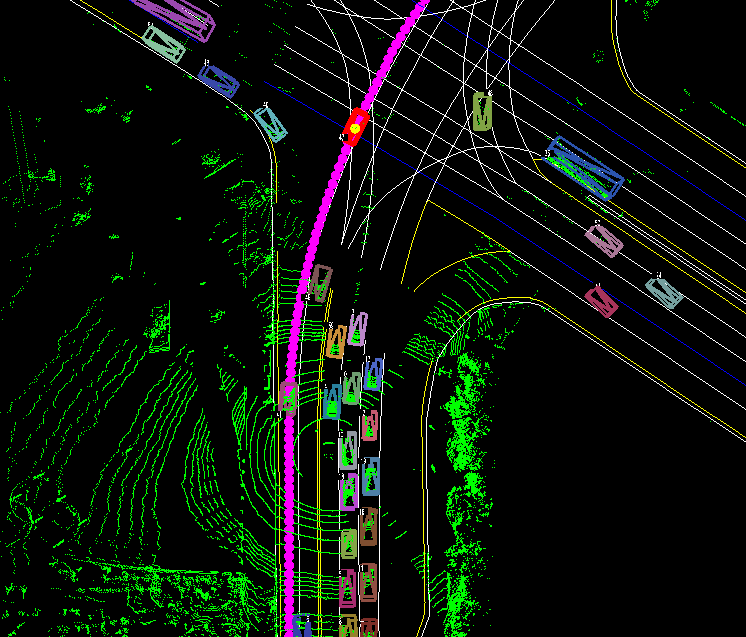

# ETRI Trajectory Prediction Challenge 2025

This repository provides potential challenge participants a gentle guide to ETRI trajectory prediction dataset and its corresponding devkit.

## ETRI Trajectory Dataset (ETD)
 
+ We acquired more than 100 driving logs, each lasting around 30 seconds, containing trajectories of our autonomous vehicle as well as its surrounding objects (e.g., vehicles, pedestrians), and sampled at 10Hz, in the vicinities of ETRI. We split the driving logs into two groups, one for training and the other for test. From a scene, we roughly generated 280 driving scenes, each containing 2 second observed trajectories, 6 second future trajectories, and HD map elements (e.g., lane centerlines) at a specific time stamp. As a result, we could generate 25,000 scenes for training and 5,000 scenes for test whose format is similar to that of Argoverse2 (https://www.argoverse.org/av2.html#forecasting-link). 
